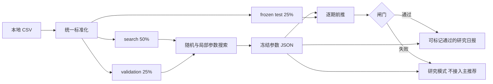

# 数字彩分析架构

## 总览

~~~mermaid
flowchart LR
    OFFICIAL[显式官方历史抓取] --> CSV[本地 CSV]
    CSV[本地 CSV] --> NORMALIZE[数字彩数据标准化]
    NORMALIZE --> SNAPSHOT[增量统计快照]
    SNAPSHOT --> STATS[多窗口统计与理论基线]
    STATS --> ADVANCED[蒙特卡洛与逻辑回归票]
    STATS --> CANDIDATES[完整空间候选评分]
    ADVANCED --> CANDIDATES
    CANDIDATES --> REPORT[Markdown / JSON 日报]
    CANDIDATES --> PICKS[开奖前推荐快照]
    PICKS --> REVIEW[后续开奖复盘与模型调权]
    NORMALIZE --> WF[严格逐期前推]
    WF --> EVAL[随机基线与窗口比较]
    EVAL --> GATE[直选/组选统计可行性闸门]
    STATS --> PROB[完整空间概率 v2]
    PROB --> CAL[选参段 / 独立守门段]
    CAL -->|通过| TOPK[直选纯 TopK / 组选排列求和]
    CAL -->|失败| UNIFORM[均匀分布回退]
    STATS --> ONLINE[在线概率 v3 专家分布]
    ONLINE --> MIX[当前权重合并]
    MIX --> PREDICT[开奖前概率与候选]
    PREDICT --> FEEDBACK[开奖后 Log Loss 反馈]
    FEEDBACK --> ONLINE
~~~

## 模块边界

- src/lotteries：福彩3D、排列三、排列五规则和号码校验。
- digit_data：CSV 列识别、拆位、范围校验、数值期号排序。
- digit_history_fetcher：固定福彩官网/中彩网白名单的显式抓取、校验和原子 CSV 写入。
- digit_statistics：经验统计、贝叶斯平滑和精确理论概率。
- digit_statistics_snapshot：首次全量、缓存命中、纯追加和原子持久化。
- digit_candidates：完整号码空间评分、集成分位和多样性选择。
- digit_advanced_models：蒙特卡洛与逻辑回归票的统一入口。
- digit_report：日报、投注结构、推荐留痕和结构化 JSON。
- digit_walk_forward：无未来数据污染的逐期训练与随机基线比较。
- prediction_viability：精确随机右尾概率、置信下界、分块稳定性和最终可行性判定。
- digit_pick_tracking：开奖前留痕、实盘复盘及相对同候选随机基线的保守调权。
- digit_probability：三位彩完整概率空间、模型剖面消融、Log Loss校准、均匀回退和纯TopK选择。
- digit_probability_walk_forward：冻结一次校准后逐期计算Log Loss、Brier、排名与命中闸门。
- digit_probability_online：固定更新规则，逐期合并专家概率、开奖后更新权重并输出完整反馈证据。
- digit_report online_probability：日报消费在线状态，新增开奖后更新状态并生成下一期概率快照；状态指纹失配时全量重建。

## 关键约束

- 日报快照只服务当前统计，不参与严格前推。
- 日报和回测不隐式联网，只有 `digit-fetch` 命令允许访问固定来源。
- 前推每个目标期独立截断历史，禁止读取目标期及其后数据。
- 文件快照和日报使用同目录临时文件、fsync 与 os.replace。
- 复合分和集成分只用于排序；只有概率 v2 或 online_probability v3 的归一化 `predictedProbability` 可解释为模型分布概率，且 v3 仍未通过可行性闸门。
- 三位彩默认完整空间评分；统计闸门失败时报告必须显示不可行。
- 在线评估允许开奖后更新状态，但更新规则必须预先固定，且本期预测必须在读取本期开奖结果前完成。
- 在线日报状态只消费已开奖期；推荐快照的稳定指纹不包含 `cache_hit`/`incremental` 等运行元数据，重复运行不得改变推荐。
# learned_ranker_v4 数据流

每个目标期都重新构建仅截止上一期的 `LearnedHistoryState`，随后生成 1000 行候选特征矩阵。参数搜索预计算 search/validation 特征，但不会构建 frozen test 特征。
# learned_ranker_v4 完整化数据流

```mermaid
flowchart LR
    CSV[本地 CSV] --> CANON[标准化 + 数值期号排序\ncanonicalDataSha256]
    CANON --> SEARCH[seeded 分阶段搜索\n惰性 feature config 缓存]
    SEARCH --> PARAMS[参数产物\n实验/参数/空间 manifest]
    PARAMS --> FROZEN[冻结 test 评估]
    FROZEN --> GATES[common/direct/group gates]
    GATES --> DAILY[日报 main/research 分区]
    DAILY --> SNAP[immutable v4 snapshot]
    SNAP --> REVIEW[sourceIssue 后第一期开奖复盘]
    REVIEW --> SUMMARY[按 experiment + params 隔离汇总]
```

- 特征层对每个窗口独立计算统计，再按 canonical window weight 聚合；趋势分量仍单独进入可解释贡献。
- 搜索层不同时保留全部配置的全部目标期 DataFrame；逐配置准备、评分后释放，只保留轻量 trial 元数据。
- 写入层先对成对 Markdown/JSON/快照做完整预检，再原子写入；immutable 冲突时任何文件都不覆盖。
- v4 实盘复盘使用独立目录和 schema，不调用 v1-v3 累计汇总，避免跨版本样本污染。
