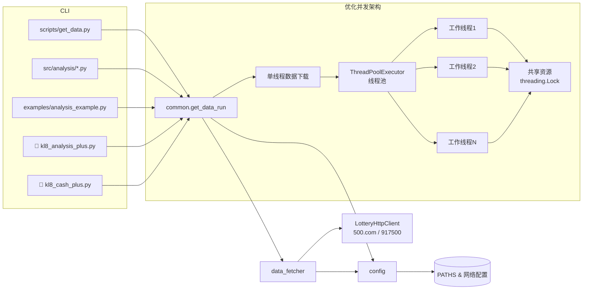
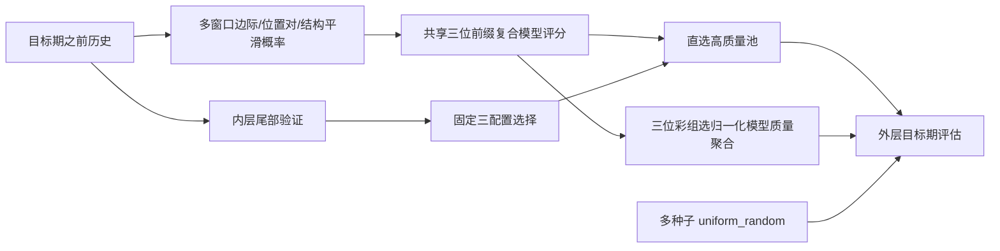

# KL8 彩票分析器架构总览（🔥 多线程优化版本）

## 模块说明

### 核心模块
- **CLI 与脚本层**：包含下载脚本、分析脚本与示例；通过 `src.common` 统一访问内部能力。
- **`src.common`**：提供数据下载与期号查询的高层接口，同时复用 `data_fetcher` 和 `config`。
- **`src.data_fetcher`**：负责 HTTP 请求、HTML/文本解析以及 CSV 写入，仅支持快乐 8。
- **`src.config`**：集中维护路径、网络超时及彩票配置；`ensure_runtime_directories` 用于初始化运行目录。

### 🚀 多线程优化模块（Plus版本）
- **`kl8_analysis_plus.py`**：优化多线程号码生成器
  - **单线程数据下载**：避免重复网络请求
  - **ThreadPoolExecutor架构**：替代多进程，消除全局变量冲突
  - **线程安全机制**：使用threading.Lock保护共享资源
  - **智能负载均衡**：动态分配工作线程，提升处理效率

- **`kl8_cash_plus.py`**：优化多线程收益分析器
  - **批量文件处理**：并发分析多个预测文件
  - **内存优化**：局部变量替代全局状态，减少内存占用
  - **错误隔离**：单个文件失败不影响整体流程
  - **实时进度监控**：动态显示处理状态和统计信息

- **主成分分析（PCA）特征增强**：自动提取历史号码矩阵主成分，提升全局特征表达能力

## 数据流

### 传统单线程数据流
1. CLI 解析参数后调用 `get_data_run` 或 `load_history`。
2. `common` 根据配置创建目录并委托 `data_fetcher` 执行网络请求。
3. `data_fetcher` 使用带重试的 `LotteryHttpClient` 抓取数据，解析后写入 `data/kl8/data.csv`。
4. 分析脚本读取 CSV 进行概率统计、约束生成和收益回测。

### 🚀 优化多线程数据流（Plus版本）
1. **启动阶段**：CLI 解析参数，初始化线程池和共享资源
2. **数据下载阶段**：
   - 主线程执行单次数据下载，避免重复网络请求
   - 调用 `download_data_if_needed()` 确保数据可用性
3. **并行处理阶段**：
   - ThreadPoolExecutor 创建工作线程池
   - 每个工作线程处理独立任务（号码生成/文件分析）
   - 使用 threading.Lock 保护共享资源访问
4. **结果汇总阶段**：
   - 线程安全地收集所有工作线程结果
   - 统一格式化输出和文件写入
   - 提供详细的处理统计和性能指标

### 性能优势对比
| 特性 | 传统版本 | Plus优化版本 |
|------|----------|-------------|
| 数据下载 | 每个进程都下载 | 主线程单次下载 |
| 并发模型 | multiprocessing.Process | concurrent.futures.ThreadPoolExecutor |
| 内存占用 | 多进程高内存 | 线程共享内存 |
| 全局变量 | 进程间冲突 | 线程安全访问 |
| 错误隔离 | 进程崩溃影响全局 | 线程失败不影响其他 |
| 监控能力 | 基础进度显示 | 实时详细统计 |
# 数字彩第二轮数据流

外层目标期只用于最终评估，不进入统计、候选生成或配置选择。位置覆盖保留为诊断输出，不再是主优化目标。
